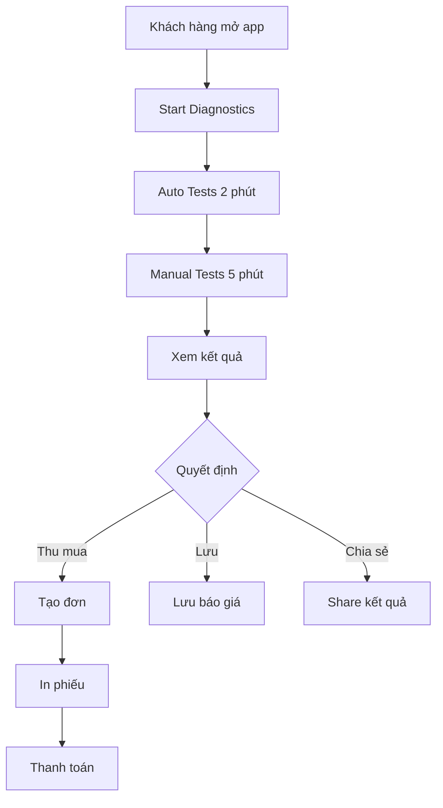

# 📱 App Kiểm Định & Thu Mua Điện Thoại

> Ứng dụng chuyên nghiệp để kiểm tra tình trạng điện thoại và đưa ra giá thu mua chính xác

[](https://flutter.dev/)
[]()

---

## 🎯 Tính năng chính

### ✅ Kiểm định tự động
- Battery, Screen, Touch, Camera
- Sensors (Accel, Gyro, Mag, Light, Prox)
- Connectivity (WiFi, BT, NFC, GPS)
- Biometric (Fingerprint/Face)

### 🎮 Kiểm định thủ công
- Touch Grid Test
- Camera Test (5 bước)
- Speaker/Mic/Earpiece Test
- Vibration Test
- Keys Test

### 💰 Ước tính giá thu mua
- Tính giá dựa trên điểm test
- Phân loại Grade A/B/C/D
- Giá theo tháng từ Excel
- Hiển thị khoảng giá

### 🔐 Admin Panel
- Import data từ Excel
- Cập nhật giá hàng tháng
- Quản lý danh sách thiết bị
- Thống kê real-time

---

## 🚀 Quick Start

### Cho Khách hàng:
```
1. Mở app → Start Diagnostics
2. Đợi auto tests (2 phút)
3. Làm manual tests (5 phút)
4. Xem kết quả & giá
5. Thu mua ngay hoặc Lưu báo giá
```

### Cho Admin:
```
1. Chuẩn bị file Excel
2. Admin Panel → Import Data
3. Upload files → Import
4. Done! ✅
```

**Chi tiết:** Xem [QUICK_START.md](QUICK_START.md)

---

## 📚 Documentation

| File | Mô tả |
|------|-------|
| [USER_GUIDE.md](USER_GUIDE.md) | Hướng dẫn đầy đủ cho User & Admin |
| [QUICK_START.md](QUICK_START.md) | Khởi động nhanh trong 5 phút |
| [EXCEL_FORMAT_GUIDE.md](EXCEL_FORMAT_GUIDE.md) | Format file Excel |
| [PHONE_IMAGES_SETUP.md](PHONE_IMAGES_SETUP.md) | Setup hình ảnh điện thoại |

---

## 🏗️ Cấu trúc Project

```
lib/
├── diagnostics/              # Module kiểm định
│   ├── controllers/          # Business logic
│   ├── models/              # Data models
│   ├── services/            # API services
│   ├── utils/               # Utilities
│   └── views/               # UI screens
│       ├── widgets/         # Reusable widgets
│       └── *.dart           # Test pages
│
├── admin/                   # Module admin
│   ├── controllers/         # Admin logic
│   ├── services/            # Excel import
│   └── views/               # Admin UI
│
└── main.dart               # Entry point

assets/
└── phones/                 # Phone images (optional)
```

---

## 🛠️ Tech Stack

- **Framework:** Flutter 3.7.2
- **State Management:** GetX
- **Storage:** SharedPreferences
- **Excel:** excel package
- **File Picker:** file_picker
- **Sensors:** sensors_plus
- **Camera:** camera
- **Audio:** audioplayers, record
- **Network:** http, connectivity_plus

---

## 📦 Installation

### 1. Clone project
```bash
git clone <repository-url>
cd kdtd_ver2_1
```

### 2. Install dependencies
```bash
flutter pub get
```

### 3. Run app
```bash
flutter run
```

---

## 🔧 Setup

### 1. Chuẩn bị Excel files

**TC_list.xlsx:**
```
Model | Marketing Name | Brand | Base Price | RAM | ROM | Year
```

**Data_2Hand_Tradein_T92025.xlsx:**
```
Model | Month | Grade A | Grade B | Grade C | Grade D
```

**Chi tiết:** Xem [EXCEL_FORMAT_GUIDE.md](EXCEL_FORMAT_GUIDE.md)

### 2. Import data
```
Admin Panel → Import Data → Upload files
```

### 3. Test
```
Chạy test với 1 thiết bị mẫu
```

---

## 📊 Quy trình sử dụng



---

## 🎓 Training

### Nhân viên mới:
- Thời gian: 2-3 giờ
- Thực hành: 5-10 đơn mẫu
- Checklist: Xem [USER_GUIDE.md](USER_GUIDE.md)

### Nội dung:
1. Quy trình kiểm định
2. Hướng dẫn khách hàng
3. Import data
4. Xử lý đơn thu mua
5. Troubleshooting

---

## 💡 Best Practices

### Khách hàng:
- ✅ Sạc pin > 50%
- ✅ Test ở nơi yên tĩnh
- ✅ Làm theo hướng dẫn
- ✅ Trung thực khi đánh giá

### Admin:
- ✅ Cập nhật giá đầu tháng
- ✅ Backup trước khi import
- ✅ Kiểm tra data sau import
- ✅ Theo dõi thị trường

---

## 🐛 Troubleshooting

### Lỗi thường gặp:

**Import failed:**
```
→ Kiểm tra format Excel
→ Đảm bảo đúng thứ tự cột
→ Export lại file
```

**Giá không hiển thị:**
```
→ Kiểm tra model name
→ Kiểm tra tháng hiện tại
→ Re-import data
```

**App chậm:**
```
→ Xóa cache
→ Restart app
→ Giảm số records cũ
```

**Chi tiết:** Xem [USER_GUIDE.md](USER_GUIDE.md)

---

## 📈 Roadmap

### Version 1.0 (Current)
- ✅ Auto diagnostics
- ✅ Manual tests
- ✅ Price estimation
- ✅ Admin import
- ✅ 3D phone visualization

### Version 1.1 (Next)
- [ ] Backend API integration
- [ ] Cloud sync
- [ ] Print receipt
- [ ] SMS/Email share
- [ ] Analytics dashboard

### Version 2.0 (Future)
- [ ] AI price prediction
- [ ] Multi-store management
- [ ] Customer database
- [ ] Warranty tracking
- [ ] Repair management

---

## 🤝 Contributing

Liên hệ team để contribute:
- Email: dev@example.com
- Slack: #dev-channel

---

## 📄 License

Proprietary - All rights reserved

---

## 📞 Support

**Technical:**
- Email: tech@example.com
- Hotline: 1900-xxxx

**Business:**
- Email: business@example.com
- Hotline: 1900-yyyy

**Emergency:**
- Zalo/Telegram: @admin

---

## 🙏 Credits

**Developed by:** [Your Company]
**Version:** 1.0.0
**Last Updated:** December 2024

---

**Made with ❤️ using Flutter**
